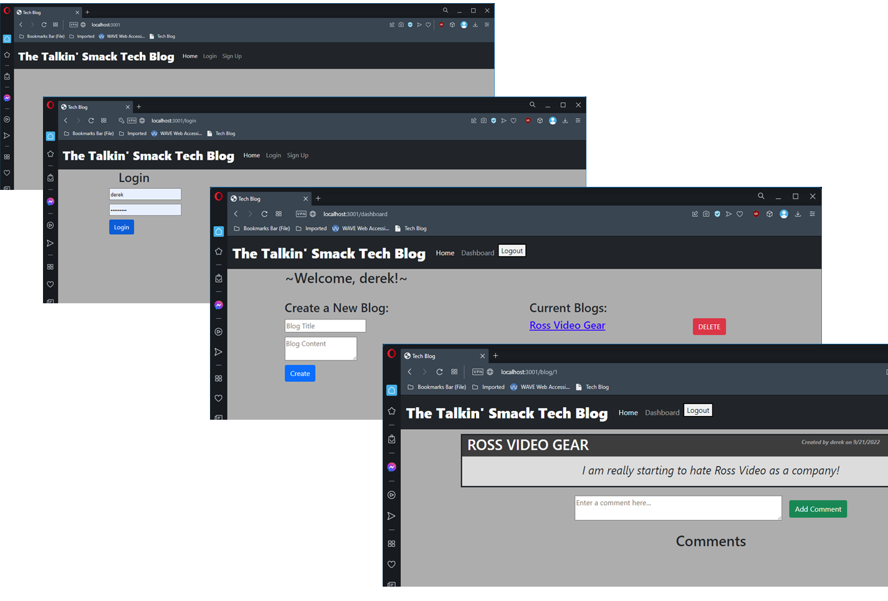

# 14 Model-View-Controller (MVC): Tech Blog

## Description

This app utilizes many different files, database storage, and technologies to create a Tech blog. A user can view any blogs on the main page and click them to see the comments. Both the post and comments will show who posted them. 

If a user would like to create their own blog they can sign up to create an account or login to an existing one. Once logged in they now have access to a dashboard for posting blogs. They can also go to other blogs and comment on them leaving their name and a date. 

The user then can logout and end their session or a timeout exists on the session as well. 
   
## Table of Contents
- [Description](#description)
- [Installation](#installation)
- [Usage](#usage)
- [License](#license)
- [Contributors](#contributors)
- [Tests](#tests)
- [Contact](#contact)

## Installation

There are no files to download for this project.

The packages required to run are:

- 
- 
- 
- 
- 
- 
- 
- 

A database will need to be created first then seeded wih data. 

## Usage

To start the process, go to the deployed site [here](https://stark-island-86668.herokuapp.com)

Then create an account or view the first few blogs and comments.  

## License

Source link for [MIT](https://opensource.org/licenses/MIT)

## Contributors

- Derek Kilgore
- Leah Green - tutor/Genius

## Contact

[GitHub Profile](https://github.com/DKILGORE79/week-14-tech-blog)

Email Me -- derek.kilgore@gmail.com

